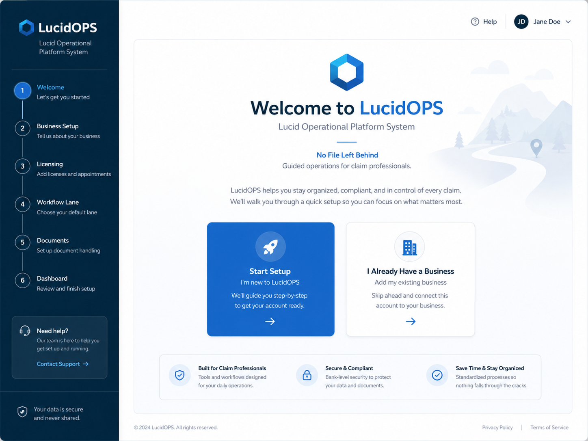
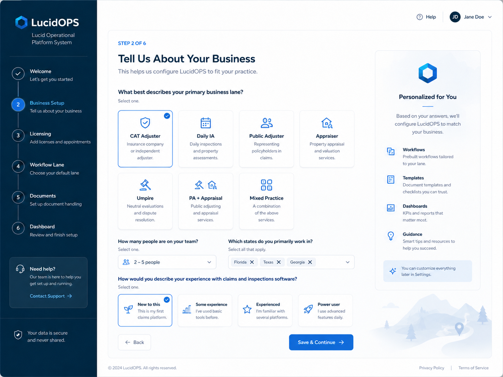
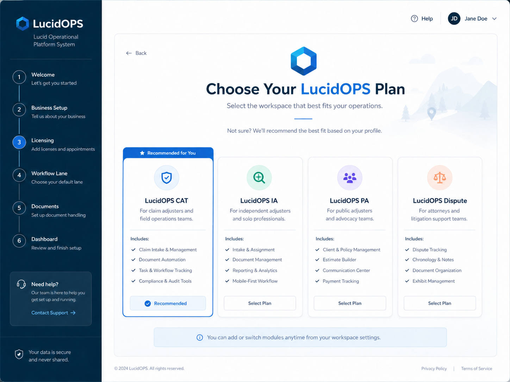
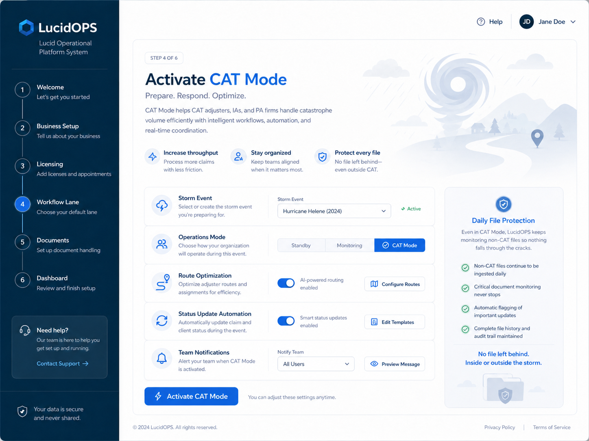

# LucidOPS Visual Startup Screen Brief for Johnny

## Working Platform Direction

**LucidOPS**  
**Lucid Operational Platform System**  
**No File Left Behind**  
**Guided operations for claim professionals.**

This visual brief is intended to help Johnny and the AI/project system understand the current product direction, startup experience, onboarding flow, and early screen concepts.

These images are not final UI. They are visual storyboards to spark product thinking, screen logic, and build direction.

---

## Core Visual Direction

LucidOPS should feel:

- Clean
- Simple
- Guided
- Professional
- Field-tested
- Operational
- Trustworthy
- Clear enough for a new user
- Powerful enough for experienced claim professionals

The platform should not feel like a generic CRM. It should feel like a guided operating system that helps claim professionals know what to do next.

The design direction should support the core idea:

> The system opens like a new computer setup experience, asks the user what type of claim business or claim work they are doing, configures the right workflow, and then guides the user into the correct operating lane.

---

## Visual Storyboard 1 — Welcome to LucidOPS

### Purpose

This is the first startup screen.

It should make the user feel like LucidOPS is going to walk them through setup step by step instead of dropping them into an empty dashboard.

### Screen Concept

**Welcome to LucidOPS**  
**Lucid Operational Platform System**  
**No File Left Behind**  
**Guided operations for claim professionals.**

The screen should give the user two clear choices:

1. **Start Setup** — for a new user or new business.
2. **I Already Have a Business** — for an existing firm that needs to configure the system around current operations.

### Product Logic

This screen should launch the guided setup wizard.

The left-side setup path can include:

- Welcome
- Business Setup
- Licensing
- Workflow Lane
- Documents
- Dashboard

### Notes for Build

The first screen should be simple and confidence-building. It should not overload the user with features. It should communicate:

- You are in the right place.
- This system will guide you.
- The setup will configure your business/workflow.
- No file left behind is the mission.

---

## Visual Storyboard 2 — Tell Us About Your Business

### Purpose

This screen identifies the user's business lane so LucidOPS can configure the right workflows, templates, dashboards, guidance, and task logic.

### Screen Concept

The system asks:

**What best describes your primary business lane?**

Possible lanes:

- CAT Adjuster
- Daily IA
- Public Adjuster
- Appraiser
- Umpire
- PA + Appraisal
- Mixed Practice

The system also asks:

- How many people are on your team?
- Which states do you primarily work in?
- What is your experience level with claim/inspection software?

### Product Logic

Based on the answers, LucidOPS should configure:

- Workflow package
- Pipeline stages
- Required documents
- Templates
- Dashboards
- Guidance prompts
- QA gates
- Suggested modules
- Pricing/subscription plan, if applicable

### Notes for Build

This screen is important because LucidOPS should not be one generic workflow.

The platform should adapt based on the user's lane:

- CAT adjusters need speed, routing, reports, status updates, and production tracking.
- Daily IAs need assignments, inspections, reports, carrier/TPA status cadence, and documentation.
- PAs need client onboarding, representation documents, carrier notification, follow-ups, dispute workflows, and fee tracking.
- Appraisers and umpires need engagement documents, evidence management, scheduling, and award/status tracking.

---

## Visual Storyboard 3 — Choose Your LucidOPS Plan / Workspace

### Purpose

This screen recommends the correct workspace/module package based on the user's setup answers.

### Screen Concept

Possible workspace cards:

- **LucidOPS CAT**
- **LucidOPS IA**
- **LucidOPS PA**
- **LucidOPS Dispute**

Each card should explain who it is for and what it includes.

### Product Logic

The system should recommend a plan or workspace, but allow the user to add or switch modules later.

Example:

If the user identifies as a CAT adjuster, the system recommends **LucidOPS CAT**.

If the user identifies as a PA firm doing storm work, the system may recommend:

- LucidOPS PA
- CAT Mode add-on
- Daily File Protection
- Document/e-sign routing
- No File Left Behind dashboard

### Notes for Build

This should feel like configuration, not a sales trap.

The point is to help the user start with the right operating mode and avoid setting up the wrong workflow.

---

## Visual Storyboard 4 — Activate CAT Mode

### Purpose

CAT Mode is the early product hook.

When a catastrophe event hits, users should be able to switch the system into high-volume storm operations.

### Screen Concept

**Activate CAT Mode**  
**Prepare. Respond. Optimize.**

Configuration sections:

- Storm Event
- Operations Mode
- Route Optimization
- Status Update Automation
- Team Notifications
- Daily File Protection

### Product Logic

CAT Mode should help:

- CAT adjusters
- Daily IAs
- PA firms
- Appraisers/umpires handling post-CAT volume

The system should support:

- Assignment intake/import
- Auto-created files
- Contact/appointment tracking
- Route optimization
- Map integration
- Inspection scheduling
- Scope/photo/document control
- Summary/inspection reports
- AI-assisted status updates
- Pre-scheduled status updates
- Quick-close identification
- Stalled-file prompts
- Revenue/fee tracking
- Hotel/base-location planning near claim clusters
- Storm data/resource links

### Daily File Protection

For PA firms, CAT Mode must not cause ordinary files to be forgotten.

The system should continue monitoring:

- Existing PA files
- Non-CAT disputes
- Appraisal files
- Payment/fee collection
- Carrier follow-ups
- Unsigned documents
- Files with no next action
- Files not touched in 7/14/21/30 days

This is a direct expression of:

**No File Left Behind — inside or outside the storm.**

---

## Major Product Insight From These Screens

The platform should not begin as a normal dashboard.

It should begin as a guided setup experience.

The user should feel:

> This system understands what kind of claim professional I am, asks the right questions, configures the right workflow, and then keeps me moving.

---

## Startup Flow Summary

Recommended startup flow:

1. **Welcome to LucidOPS**
2. **Tell us about your business**
3. **Business/license/state setup**
4. **Choose or confirm workflow lane**
5. **Recommended LucidOPS workspace/module**
6. **Document and signature setup**
7. **Requirement profile setup, if applicable**
8. **Dashboard / Command Center activation**
9. **Optional CAT Mode activation**

---

## Storyboard Priorities After These Screens

Next screens to storyboard:

1. Lead or assignment intake
2. Lead/assignment conversion to file
3. Stage-based file workspace
4. Critical task with QA gate block
5. Uploaded document e-sign routing
6. Requirement Profile setup for TPA/carrier/client rules
7. No File Left Behind dashboard
8. Daily File Protection dashboard during CAT Mode
9. CAT route planning and daily schedule view
10. AI-generated status update from file logs

---

## Build Philosophy Reminder

Keep the foundation simple:

**File -> Stage -> Task -> Document -> Note -> Follow-Up -> QA Gate -> Dashboard**

LucidOPS is not trying to become complicated software for the sake of features.

The goal is to remove uncertainty, organize chaos, and keep every file moving.

---

## Internal Note

The images in this folder are visual concepts only. They are meant to help us think through the user experience, not lock the final UI design.

Use them to inspire storyboards, functional requirements, screen maps, and prototype direction.
